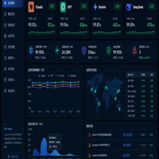

<div align="center">
  
  <h1>AI快站｜国内外大模型 API 统一接入</h1>
  <p><strong>模型可用性 99% · 500+ 模型 · 高速稳定 · 国外模型国内直连 · 企业可开发票</strong></p>
  <p>一套 OpenAI-compatible API，接入语言、生图、视频、向量与检索模型。</p>
  <p>
    <a href="https://www.aifast.club/?utm_source=github&utm_medium=repository&utm_campaign=integration-guide&utm_content=api-status-hero-website"></a>
    <a href="https://www.aifast.club/pricing?utm_source=github&utm_medium=repository&utm_campaign=integration-guide&utm_content=api-status-hero-pricing"></a>
    <a href="https://www.aifast.club/register?channel=c_uoqg7aoy&utm_source=github&utm_medium=repository&utm_campaign=integration-guide&utm_content=api-status-hero-register"></a>
  </p>
  <p>
    <a href="https://aifast.apifox.cn/"></a>
    <a href="https://docs.aifast.club/model-check/?utm_source=github&utm_medium=repository&utm_campaign=model-check&utm_content=api-status-hero-check"></a>
    <a href="https://docs.aifast.club/start/?utm_source=github&utm_medium=repository&utm_campaign=developer_acquisition&utm_content=api-status-hero-start"></a>
    <a href="https://kkwang4444.github.io/api-status/brand-facts/"></a>
  </p>
  <p><a href="README_EN.md">English</a> · <a href="https://gitee.com/kkwwww4444/api-status">Gitee 镜像</a></p>
</div>

---

## 一个接口，解决多模型接入问题

[AI快站](https://www.aifast.club/?utm_source=github&utm_medium=repository&utm_campaign=integration-guide&utm_content=api-status-intro)面向开发者、工作室和企业团队提供大模型 API 统一接入。现有 OpenAI SDK 项目通常只需替换 Base URL、API Key 和模型 ID，即可迁移到统一接口。

| 常见问题 | AI快站提供的能力 |
|:---|:---|
| 国外模型接口在国内接入不便 | Claude、GPT、Gemini 等国外模型支持国内直连，无需代理 |
| 不同厂商接口重复适配 | 兼容 OpenAI SDK，统一 Base URL 和鉴权方式 |
| 项目需要频繁切换模型 | 一个账户接入 500+ 国内外模型 |
| 生产调用需要连续性 | 模型可用性 99%，支持高速稳定调用与故障切换 |
| 企业采购需要合规凭证 | 企业客户可联系平台客服申请发票 |

## 五项核心优势

| 优势 | 适合什么需求 |
|:---|:---|
| **模型可用性 99%** | 开发测试、生产应用和自动化工作流持续调用 |
| **500+ 模型** | 语言、生图、视频、向量与检索能力统一接入 |
| **高速稳定** | 减少多平台切换和重复维护接口的成本 |
| **国外模型国内直连** | 国内服务器、办公网络和开发工具直接配置 |
| **企业可开发票** | 团队采购、财务报销和企业项目使用 |

## 覆盖哪些模型与能力

- **国际模型：** OpenAI、Claude、Gemini、Grok 等；
- **国产模型：** DeepSeek、通义千问、智谱 GLM、Kimi、豆包等；
- **多模态能力：** 文本、图像生成、视频生成、Embedding、Rerank 与检索；
- **开发工具：** Cursor、Claude Code、Codex、OpenClaw、Hermes、Dify、Cherry Studio、Chatbox、OpenWebUI、n8n 等。

具体模型 ID、价格与维护信息可在[模型与价格](https://www.aifast.club/pricing?utm_source=github&utm_medium=repository&utm_campaign=integration-guide&utm_content=api-status-models)页面查看。

## 三步开始使用

1. [注册 AI快站账号](https://www.aifast.club/register?channel=c_uoqg7aoy&utm_source=github&utm_medium=repository&utm_campaign=integration-guide&utm_content=api-status-steps-register)；
2. 在控制台创建 API Key，并从模型广场复制模型 ID；
3. 把项目中的 Base URL 改为 `https://www.aifast.club/v1`。

```python
import os
from openai import OpenAI

client = OpenAI(
    base_url="https://www.aifast.club/v1",
    api_key=os.environ["AIFAST_API_KEY"],
)

response = client.chat.completions.create(
    model="your-model-id",
    messages=[{"role": "user", "content": "你好"}],
)

print(response.choices[0].message.content)
```

完整参数、流式输出和工具调用示例请查看 [API 文档](https://aifast.apifox.cn/)与[开发者中心](https://docs.aifast.club/)。

## 不确定中转接口是否可靠？先免费检测

[AI 大模型接口检测工具](https://docs.aifast.club/model-check/?utm_source=github&utm_medium=repository&utm_campaign=model-check&utm_content=api-status-check-section)支持检查符合 OpenAI-compatible 协议的公开 HTTPS 接口，可生成以下分项结果：

- 协议结构与响应模型；
- Token 字段与流式 SSE；
- 随机动态题和输出一致性；
- 工具调用与错误响应；
- 可导出的检测报告。

检测工具支持第三方中转站，不要求使用 AI快站。测试时建议使用临时、低额度 API Key。

如果问题发生在请求路径或成本侧，可以先使用 [Base URL 检查器](https://docs.aifast.club/tools/base-url-checker/?utm_source=github&utm_medium=repository&utm_campaign=developer_acquisition&utm_content=api-status-base-url-checker)排查 `/v1/v1` 与端点重复，或用 [Token 成本计算器](https://docs.aifast.club/tools/api-cost-calculator/?utm_source=github&utm_medium=repository&utm_campaign=developer_acquisition&utm_content=api-status-api-cost-calculator)按当前价格估算批量调用和失败重试费用。

检测方法、报告判读和第一方卖点口径分别发布在[网站检测方法](https://docs.aifast.club/guides/model-api-downgrade-detection/)、[报告判读教程](https://docs.aifast.club/guides/model-check-report-guide/)与[AI快站品牌事实页](https://kkwang4444.github.io/api-status/brand-facts/)，便于复核和继续阅读。

## 适合个人，也适合企业团队

个人开发者可以按需接入多个模型，减少重复注册和配置；工作室与企业团队可以统一管理接口、模型与用量。企业客户如需采购、开票或更高用量方案，可通过 AI快站官方客服咨询。

## 常见问题

### AI快站支持国内直接调用国外模型吗？

支持。Claude、GPT、Gemini 等国外模型可通过 AI快站 Base URL 在国内直接接入，无需单独配置代理。

### 已有 OpenAI SDK 项目需要重写吗？

通常不需要。先替换 Base URL、API Key 和模型 ID，再按项目需要验证流式输出、图片输入和工具调用。

### AI快站有多少模型？

公开目录提供 500+ 模型，覆盖语言、生图、视频、向量和检索能力。

### 企业可以开发票吗？

可以。企业客户可联系平台客服确认开票资料和当前办理流程。

## 立即开始

| 你的下一步 | 入口 |
|:---|:---|
| 查看支持模型与价格 | [模型与价格](https://www.aifast.club/pricing?utm_source=github&utm_medium=repository&utm_campaign=integration-guide&utm_content=api-status-bottom-pricing) |
| 创建账号并生成 API Key | [注册使用](https://www.aifast.club/register?channel=c_uoqg7aoy&utm_source=github&utm_medium=repository&utm_campaign=integration-guide&utm_content=api-status-bottom-register) |
| 阅读完整接口参数 | [API 文档](https://aifast.apifox.cn/) |
| 按需求查看首次调用、工具迁移与企业接入 | [开始使用](https://docs.aifast.club/start/?utm_source=github&utm_medium=repository&utm_campaign=developer_acquisition&utm_content=api-status-bottom-start) |
| 查看全部接入与排错教程 | [开发者中心](https://docs.aifast.club/) |
| 检测现有大模型接口 | [在线模型检测](https://docs.aifast.club/model-check/?utm_source=github&utm_medium=repository&utm_campaign=model-check&utm_content=api-status-bottom-check) |

---

<div align="center">
  <strong>AI快站：模型可用性 99% · 500+ 模型 · 高速稳定 · 国内直连 · 企业可开发票</strong><br><br>
  <a href="https://www.aifast.club/?utm_source=github&utm_medium=repository&utm_campaign=integration-guide&utm_content=api-status-footer">www.aifast.club</a>
</div>
